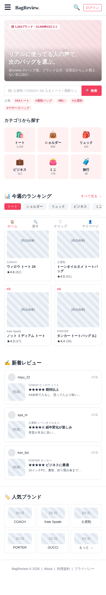
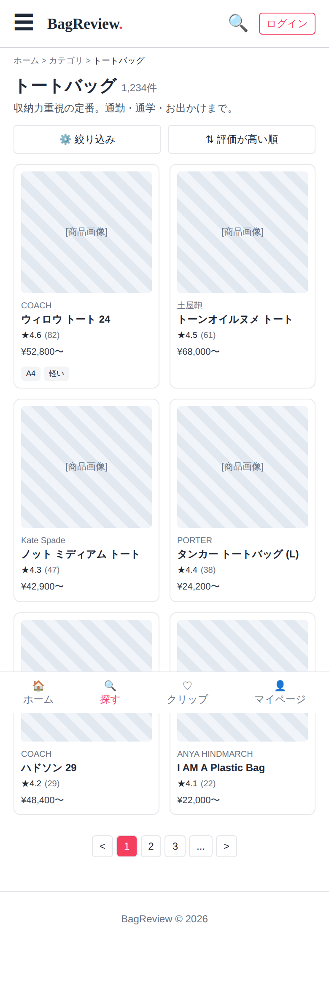
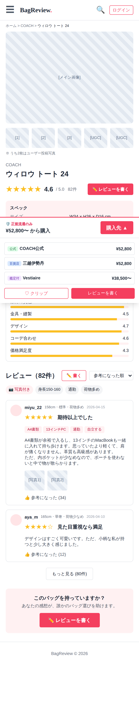
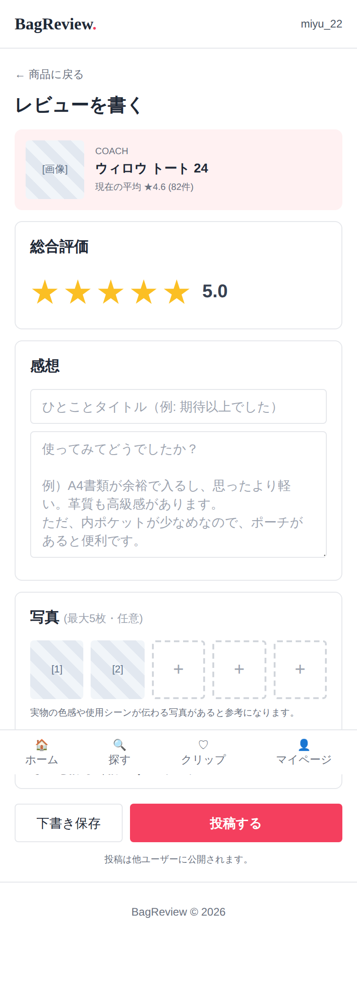
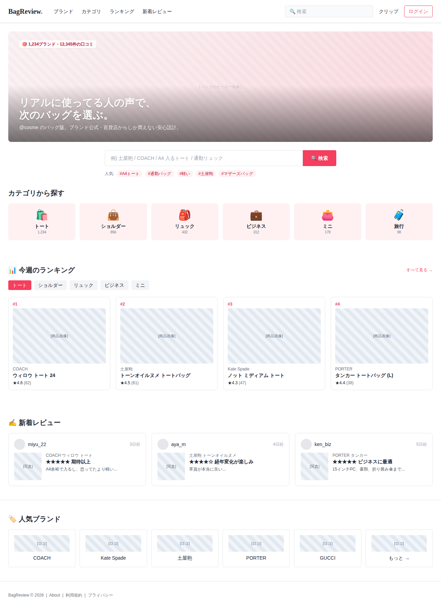
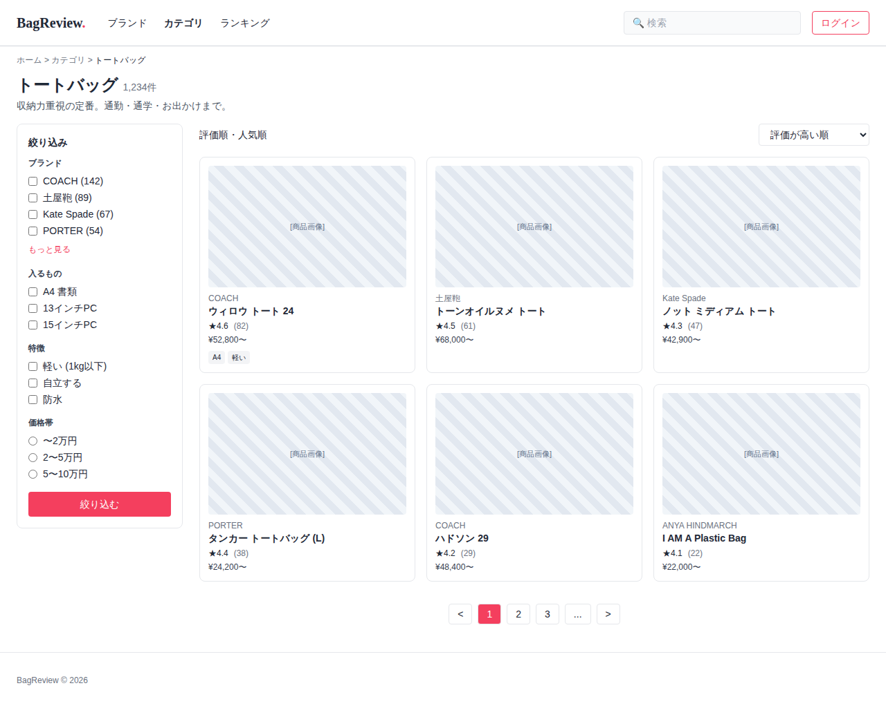
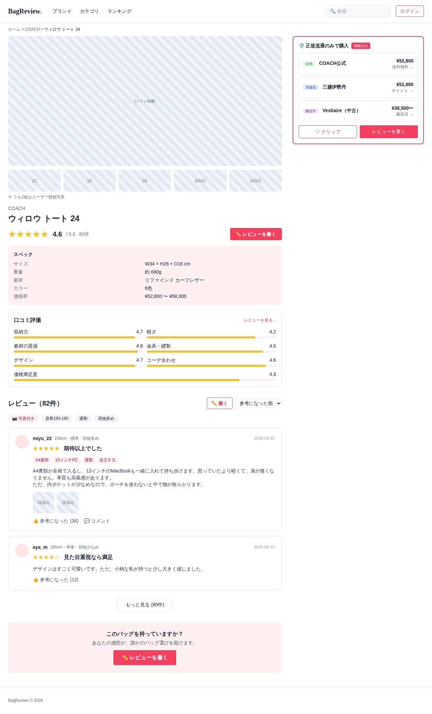
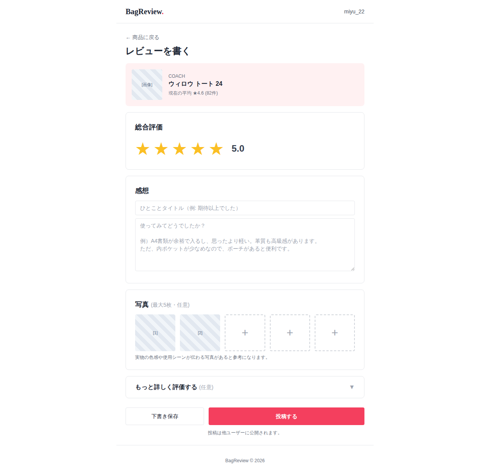

# ワイヤーフレーム（v0.2）

バッグ口コミサイトの主要画面。PC / モバイル両対応。

## スクリーンショット（スマホからも見れます）

### 📱 モバイル版

| トップ | カテゴリ一覧 | 商品詳細 | レビュー投稿 |
|---|---|---|---|
|  |  |  |  |

### 🖥️ デスクトップ版

| トップ | カテゴリ一覧 | 商品詳細 | レビュー投稿 |
|---|---|---|---|
|  |  |  |  |

## 画面一覧（HTML）

| ファイル | 画面 | 目的 |
|---|---|---|
| [index.html](index.html) | トップ | ランキング・新着レビュー・人気ブランド |
| [category.html](category.html) | カテゴリ一覧 | 絞り込み + 商品グリッド |
| [product.html](product.html) | 商品詳細 | ★集計・スペック・正規EC リンク・レビュー一覧 |
| [review.html](review.html) | レビュー投稿 | ★評価 + サブ評価 + タグ + 本文 + 写真 |

## ローカルで開く

```
open docs/wireframes/index.html  # Mac
xdg-open docs/wireframes/index.html  # Linux
```

スタイルは `tailwind.css`（ビルド済み）を参照します。

## 方針

- **低fi**: プレースホルダ画像（斜線パターン）、実データは仮置き
- **アイボリー基調 + バーガンディアクセント**: #F8F6F2 / #7A4D3C / ゴールドの★ #D4A24E
- **正規流通リンク**を商品詳細に強調表示（公式 / 百貨店 / 鑑定付 バッジ）
- **モバイル対応**: ボトムナビ、ハンバーガー、グリッド段組調整
